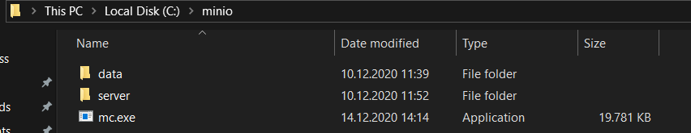
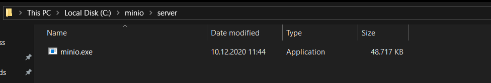

# **Spring Boot App With MinIo File Storage Server**

**MinIo Docker Container Command:**  docker run -p 9000:9000 --name MyMinio -e "MINIO_ACCESS_KEY=test" -e "MINIO_SECRET_KEY=test1234"  minio/minio server /data

**Local MinIo Client Server Location**

https://docs.min.io/docs/minio-client-quickstart-guide.html 

